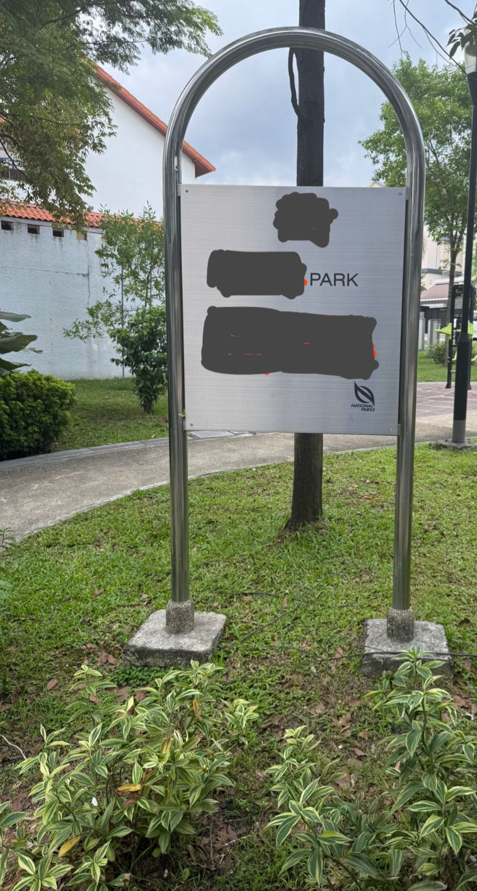

### 問題

> Warm up your OSINT skills with this challenge!
You are given an image of a sign in the park.
Submit the text on the sign as the flag in lowercase, converting all new lines and spaces to underscores.
For example, if the sign looks like this:
ABC PARK
123 Main St. 
Singapore
Then, submit the flag as `grey{abc_park_123_main_st_singapore}.`

次の公園の看板のの文字を調べなさいという問題でした。

### 解法

看板の下に「NATIONAL PARKS」と書いてあります。これはシンガポールの公園のことを示すそうです。
Google Lensに入れても同じ看板が全然出てこなくて時間を溶かしていました。

何時間か時間を溶かしていたら、別の画角で撮られた看板が出てきました。

このアルミの看板はシンガポールの公園にしては珍しかったので、看板の形状がわかるようにCropして投げたら出てきた気がします。

[Upper Serangoon Road Interim Park: Ingress portal](https://outgress.com/portals/upper-serangoon-road-interim-park.3640457/)

`grey{interim_park_upper_serangoon_road}`

シンガポールにもまだインターネットから全然見えない未開の地があるんだと知る問題でした。
