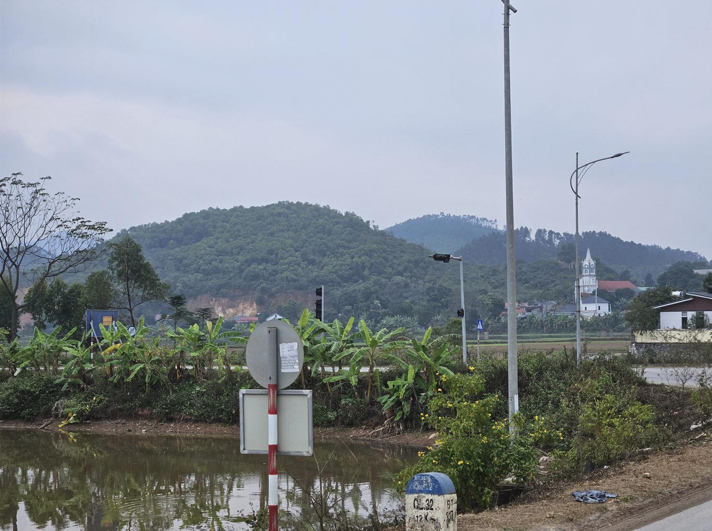
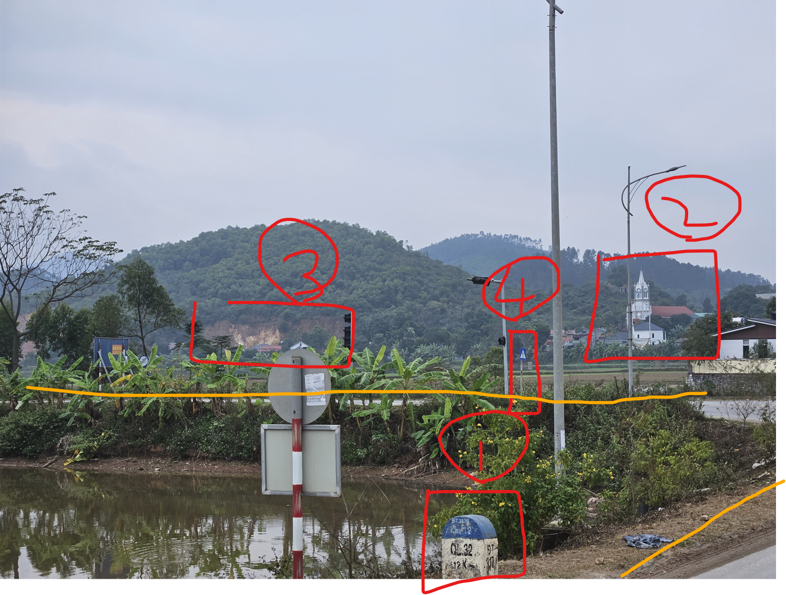
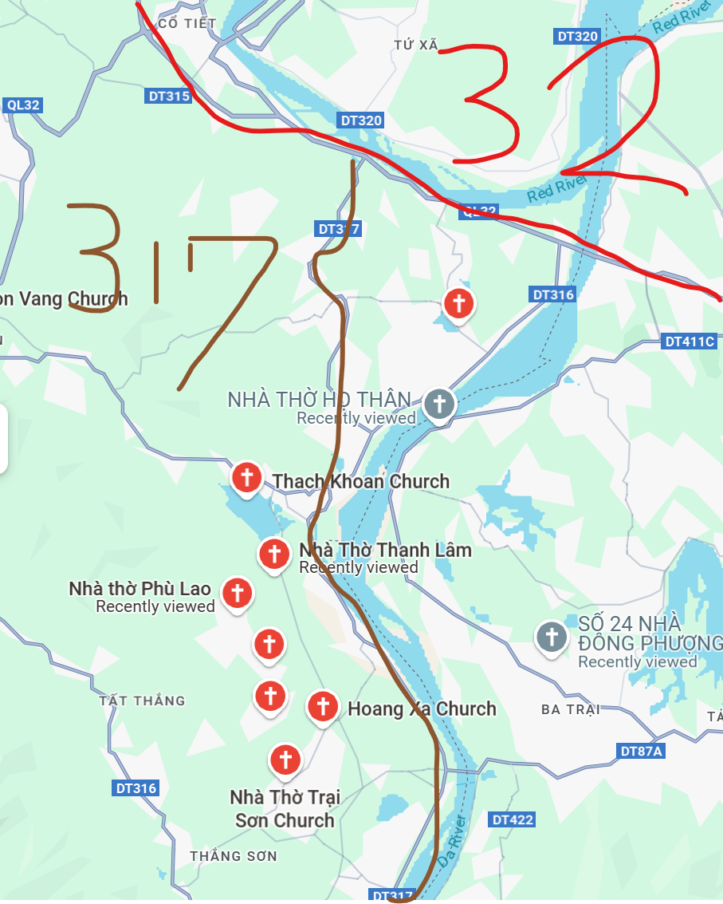
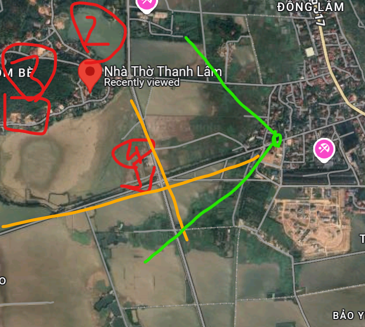
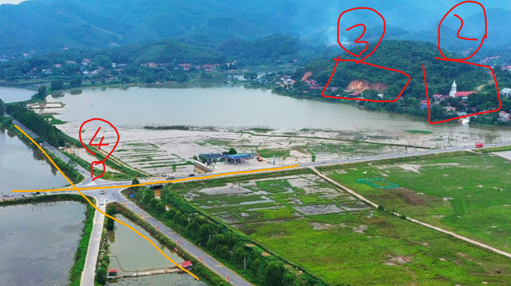

### 問題

> I saw a church in the distance while travelling. Can you tell me where it is?
The flag consists of latitude and longitude coordinates of the location where the photo was taken, rounded to three decimal places, and the name of the church in the distance in lowercase (according to google maps, omitting any potential spaces, punctuation and diacritics).
Regarding flag format, consider this example for Notre Dame de Paris: `grey{N48-853_E2-349_notredamecathedralofparis}`

次を答える問題でした。
- 写真が取られた場所の座標（小数点第3位まで）
- 教会の名前

### 解法

状況を分析します。

1. ボラードにQL32, DT317Gと書いてある
2. 塔の形状が特徴的な教会が見える
3. 山の肌が見える
4. 横断歩道と信号がある

以上の分析と道路の様子から写真は信号がある交差点の手前で撮られたと推測されます。

Google Lensに入れても出てこなかったので、情報から場所を絞ります。
QL32とDT317はベトナムの道路の名前のようです。QL32とDT317が交わる地点で教会を探してみました。

全部の教会を調べていきます。すると、「Nhà Thờ Thanh Lâm」という教会と外観が一致します。
付近のストリートビューを調べたところ、次の緑の場所から教会が見えるストリートビューがありました。
偶然にも高い位置から撮影されており、今回のランドマーク全てが見えました。ドローンで撮られたのでしょうか。

ベトナムの田舎では全然横断歩道が見当たりませんね。撮影地点は4番の交差点の手前でしょうね。

`grey{N21-153_E105-274_nhathothanhlam}`

はじめは、ボラードはQL32やDT317Gの上に設置されていると思っていましたが、そうでないこともあるんですね。
今回はボラードがQL32やDT317の近くにあることを示しているだけだったようです。

