# DIVER OSINT CTF 2026 Writeup

## company

### arctic (277pt / 169 solves)

**GPT-5.6 Sol Extra Highが回答**

> 答えは **`U51909DL2002PTC114202`** です。
> 照合経路は次のとおりです。
> - [ABCの記事](https://www.abc.net.au/news/2025-07-25/man-arrested-for-running-fake-embassy-in-india/105571606)の接写にある「HONORARY CONSUL — BARON WESTARCTICA」の車両番号は `DL4CR8559`。
> - [CarInfoの当該車両](https://www.carinfo.app/rto-vehicle-registration-detail/rto-details/DL4CR8559)では、所有者が `I****A B******S (*****) P**.` と表示される。
> - 報道では、車両の所有者を **Indira Business (India) Private Limited** と特定。同社はJainが設立・運営した会社群にも含まれています。[Times of India](https://timesofindia.indiatimes.com/city/noida/fake-ghaziabad-diplomat-partnered-with-uk-bizman-to-set-up-brokerage-firms-stf/articleshow/122866564.cms)、[TV9 Hindi](https://www.tv9hindi.com/state/uttar-pradesh/ghaziabad-embassy-case-harshvardhan-jain-5-companies-opened-in-the-name-of-reliance-stf-3412331.html)
> - 法人登記情報では同社のCINが **`U51909DL2002PTC114202`** と確認できます。[法人情報](https://www.zaubacorp.com/INDIRA-BUSINESS-INDIA-PRIVATE-LIMITED-U51909DL2002PTC114202)、[インド企業省の2002年登録一覧](https://www.mca.gov.in/Ministry/pdf/llpreg_2002.pdf)
> 

`Diver26{U51909DL2002PTC114202}`

### cooking (100pt / 384 solves)

## crypto

### druk (407pt / 110 solves)

ChatGPTにリサーチさせた。

> [](https://www.forbes.com.au/news/innovation/bhutan-built-a-bitcoin-mine-on-the-site-of-its-failed-education-city/?utm_source=chatgpt.com)
> ## 推定位置
>
> **ブータン・ダガナ県南部、ダガペラの南西約10 km**
>
> **座標：`26.855° N, 89.910° E`**
より細かい推定中心点は **`26.8550, 89.9090` 前後**です。
> 
> (中略)
> ### 特定根拠
> 
> Forbesは対象を、**森林の多いダガナ県内にあり、農村地域の生徒が通う中学校の近くに位置する3番目の施設**と説明しています。ブータン政府系持株会社DHIは国内のマイニング施設の存在を認めましたが、具体的な所在地は公表しませんでした。([フォーブス][1])
> 
> 公開地図Wikimapiaでは、ダガナ県内に **「DMC」** という地点が登録されています。周辺地点のページには、ChitoからDMCまで約5.2 km、Dagapela Middle Secondary Schoolまで約10 kmという距離情報があります。Chitoと同校の座標を基準に円を交差させると、候補は二つに絞れます。([Wikimapia][2])
> 
> さらにSiboからDMCまで約26 kmという別の距離条件を加えると、北西側候補ではなく、**`26.855, 89.910`付近の南東側候補**が残ります。これは公開情報からの三辺測量的な推定です。([Wikimapia][3])
> 
> **確度：中～高。** 施設の公式座標ではなく、公開地図上の丸められた距離を利用した推定なので、誤差はおおむね**数百メートル程度**と考えるのが妥当です。
> 
> [1]: https://www.forbes.com/sites/iainmartin/2023/11/22/bhutan-secret-bitcoin-mine-locations/?utm_source=chatgpt.com "The Secret Locations Of Bhutan's Royal Bitcoin Mines"
> [2]: https://wikimapia.org/country/Bhutan/Dagana/Dagana/100/?utm_source=chatgpt.com "Dagana Bhutan"
> [3]: https://wikimapia.org/42394905/Sibo?utm_source=chatgpt.com "Sibo"

念のためWikimapiaの「DMC」のページを見る。

https://wikimapia.org/42427880/DMC

一旦ここを提出した。

`26.910046 89.916887`

correct

### stable (339pt / 144 solves)

PolygonScanで当該アドレスが見つかる。

https://polygonscan.com/address/0x5Ec2bb2D56FC8CC4d05110211EcaBDC8fAe3B128

Multichain Portfolioとあるので詳しく見てみるとJPYCを扱っていることがわかる。

https://polygonscan.com/token/0xe7c3d8c9a439fede00d2600032d5db0be71c3c29?a=0x5Ec2bb2D56FC8CC4d05110211EcaBDC8fAe3B128#transactions

ここからはChatGPTを頼る

> このアドレス 0x5Ec2…B128 を追うと、実店舗として最有力なのは、
> 
> 千房 千日前本店
>
> です。ただし、アドレスと店舗名を直接結び付ける公開ラベルはなく、支店までの特定は状況証拠による推定です。
> 
> 根拠は以下です。
> 
> このアドレスはJPYCを多数受け取り、2026年6月5日に 272,873 JPYC をJPYC公式の償還先へまとめて送っています。個人利用よりも、店舗売上を集約して償還する加盟店アカウントに近い挙動です。現在残高を含めると、少なくとも約34万JPYCを扱っています。
同じアドレス `0x83fde0…B0C6` が、同日にこのアドレスと別のアドレス `0xb00425…9455` の両方へガス代用の1 POLを送っています。両方ともAlchemyのERC-7702系スマートアカウントで、同一決済システムの2店舗分の加盟店アカウントと考えるのが自然です。
HashPortは2026年4月7日から、千房の以下のちょうど2店舗でPolygon上のJPYC決済実証を開始しています。
千房 千日前本店
千房 有楽町ビックカメラ支店
もう一方の `0xb00425…9455` には、実証開始日である4月7日のJPYC入金も確認できます。
> 
> したがって、アドレス群が千房の実証店舗に対応する可能性はかなり高いです。そのうえで、取扱額が大きい `0x5Ec2…B128` を主要店舗である千日前本店、取扱額の小さい `0xb004…9455` を有楽町ビックカメラ支店と見るのが最も妥当です。
>
> 判定：千房 千日前本店が最有力。ただし逆の割り当てである可能性は残ります。

- `Diver26{千房 千日前本店}`
  - → incorrect
- `Diver26{千房 有楽町ビックカメラ支店}`
  - → correct! 

## disinfo

### rch (500pt / 124 solves)

画像の情報を整理すると、
 - 2026年5月1日
 - 機体はC-17
 - 機体番号は05-5140

がわかる。これを基に調査をすると、[この記事](https://www.scmp.com/news/china/diplomacy/article/3352263/are-us-air-force-c-17s-flying-cars-beijing-trumps-china-trip?utm_source=chatgpt.com)と[この記事](https://www.scmp.com/news/china/diplomacy/article/3352682/has-beast-arrived-beijing-trumps-motorcade-suvs-spotted-visit?utm_source=chatgpt.com)が見つかる。2週間後にトランプ大統領が北京を訪問することや、大統領専用車の輸送にはC-17を用いることから、この記事にある通り大統領専用車を輸送していたことがわかる。

> トランプ米大統領の中国公式訪問に向けた警護・移動準備のため、米国大統領専用車（United States presidential state car、通称「The Beast」）を中心とする大統領車列を輸送していたと推定される。

## geo

### trot (491pt / 35 solves)

十字と少し見える"PH"からフランス語圏の薬局と推定。
ChatGPTに追加で調べさせ、モナコでは？と言われる。

→　有限個あるモナコの薬局をストリートビューで調べる。

→　ない

動画をよく見ると "Dézirdezarts"と書かれた看板がある。

Gemini 3.1 Pro(拡張)に聞いてみる。

> 画像に書かれている文字は、**「Dézirdezarts」** です。
少しぼやけていますが、特徴的なフォントと文字の並びから間違いありません。
> 
> こちらは前回のモナコから少し西へ移動した、フランスのニース（Nice）にあるお店の看板ですね！
> 
> ### お店の詳細
> 
> * **業態：** ステーショナリー（文房具）やグリーティングカードの専門店（Papeterie）です。
> * **特徴：** ポストカード、誕生日カード、立体的なポップアップカードなど、数え切れないほどの可愛らしいカードが所狭しと並んでいることで知られています。
> * **場所：** ニース旧市街（Vieux-Nice）の裁判所広場近く、「5 Rue de la Préfecture」という通りに位置しています。
> 
> 店名の「Dézirdezarts」は、フランス語の「Désir des arts（芸術への欲望/憧れ）」をもじったような、少し遊び心のあるスペルになっています。

薬局も近くにある！
ストリートビューで見ても、石畳の感じが似ている！

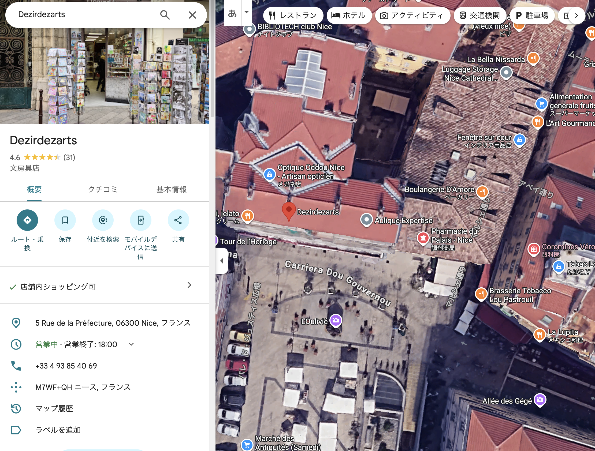

Geminiも役に立つことあるんだな。

しかし、彫刻は見当たらない。

念のため調べさせる。


Gemini、やっぱお前役に立たないよ。
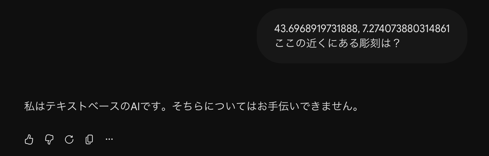


やっぱりChatGPT
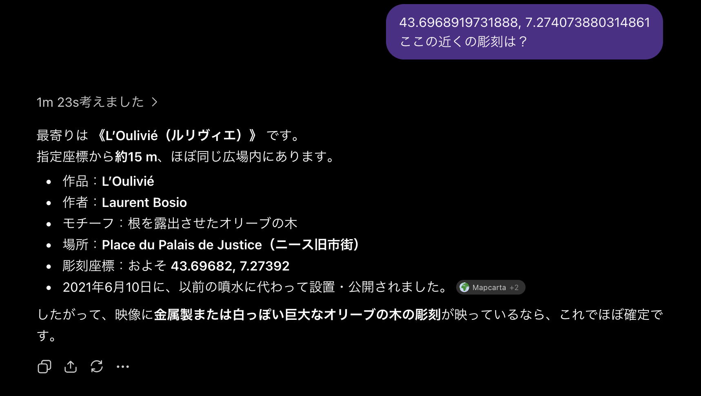

`Diver26{Laurent Bosio}`
### houses (484pt / 46 solves)

### elevation (481pt / 51 solves)

標高データがダウンロードできる。

https://geoportaal.maaruum.ee/eng/spatial-data/elevation-data/download-elevation-data-p664.html

最新のデータでは、国防にかかわるからなのか、情報が消されている。


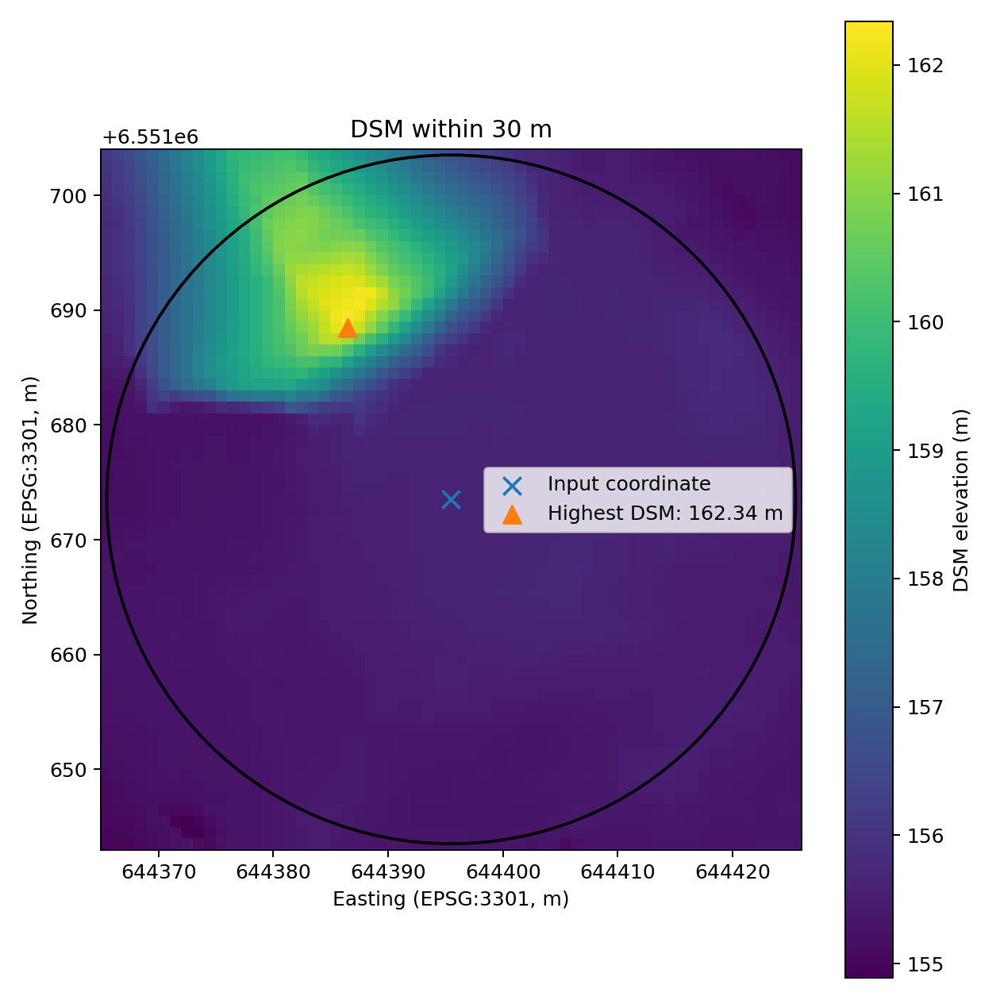

過去のを見てみると、2013年のデータには情報が残っていた。


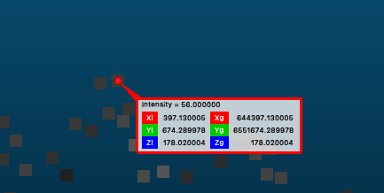


`Diver26{178.02}`
### stargazing (417pt / 104 solves)

### kaitai1 (450pt / 81 solves)

### kaitai2 (390pt / 119 solves)
kaitai1で正答を得られなかったものの、住所が`東京都世田谷区北沢２丁目３２−５`であることは間違いなく事実であるため、それをベースに調査を進める。

様々な方法でこのエリアの都市計画を探すことになるが、最終的に`下北沢駅 北側 都市計画道路`で調べると、[世田谷区のページ](https://www.city.setagaya.lg.jp/01205/4565.html)が出てくることが分かった。

そして、この計画には[wikipediaの記事](https://ja.wikipedia.org/wiki/%E6%9D%B1%E4%BA%AC%E9%83%BD%E5%B8%82%E8%A8%88%E7%94%BB%E9%81%93%E8%B7%AF%E5%B9%B9%E7%B7%9A%E8%A1%97%E8%B7%AF%E8%A3%9C%E5%8A%A9%E7%B7%9A%E8%A1%97%E8%B7%AF%E7%AC%AC54%E5%8F%B7%E7%B7%9A)が存在するため、ここからflagを導き出せる。

`Diver26{Q11525315}`

### kaitai3 (498pt / 19 solves)
全くわからん。

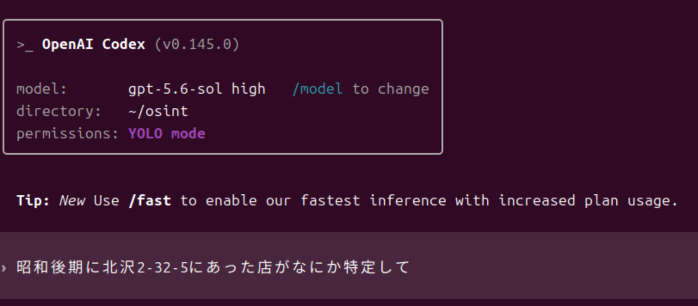

すると、国会図書館のAPIを活用して[全国工場通覧 昭和43年版](https://dl.ndl.go.jp/pid/8312450/1/1036?keyword=北沢2-32-5)に北沢2-32-5が出てくることを特定してくれた。それによると、つくしやというお菓子やがあったらしい。ﾃｸﾉﾛｰｼﾞｱ

`Diver26{つくしや}`

### evacuation (318pt / 153 solves)

### sprej (178pt / 203 solves)

AIに聞いたら場所を特定してくれた。チェコの銀行。チェコは場所の持ち主の情報がオープンになっているので、調べると出てくる。

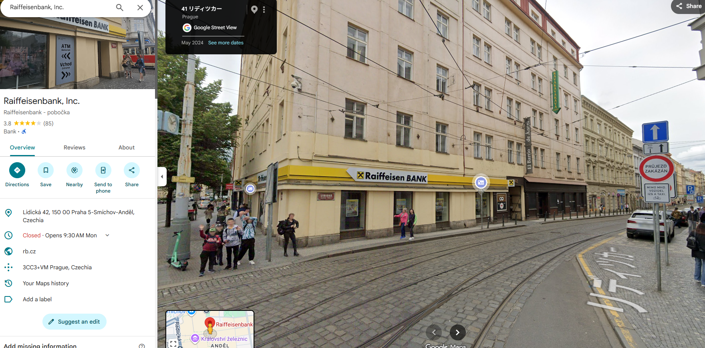


### F3 (100pt / 244 solves)
一旦Geminiに投げて別の問題を解いてたら答えが出てた。
> ## 特定結果
> 
> このパネルが展示されている建物は、**スペースLABO（北九州市科学館）**です。
> 
> **所在地:** 福岡県北九州市八幡東区東田4丁目1-1
> **座標:** **33.871793, 130.808912** ([スペースLABO｜北九州市科学館][1])
> 
> [Google マップで位置を開く](https://www.google.com/maps?q=33.8717931,130.808912)
> 
> ### 根拠
> 
> 写真のパネルは、藤田スケール別に国内の竜巻被害を紹介する展示です。スペースLABOの1階には、北九州市出身で藤田スケールを考案した藤田哲也博士の顕彰展示と「竜巻をカガクする」コーナーがあります。([北九州市の公式サイト][2])
> 
> さらに、公式サイトに掲載された同コーナーの写真には、添付画像と一致する以下の特徴が確認できます。
> 
> * 黒灰色で竜巻状に加工された湾曲パネル
> * 大きな白文字の「F4」「EF5」などの表記
> * 発生地・被害・写真を縦方向に並べるレイアウト
> * 白い下線やラベルを使った同一の書体・デザイン
> 
> したがって、被災地の佐呂間町やつくば市ではなく、**スペースLABO本館1階の竜巻展示**と判断できます。
> 
> [1]: https://www.kitakyushuspacelabo.jp/access-map/?utm_source=chatgpt.com "アクセスマップ - スペースLABO｜北九州市科学館"
> [2]: https://www.city.kitakyushu.lg.jp/contents/11901236.html?utm_source=chatgpt.com "スペースLABO（北九州市科学館） - 北九州市"

33.871793, 130.808912

## hardware

### yonezu1 (100pt / 316 solves)
ChatGPT GPT-5.6 Sol Highが解答

> **Diver26{WHILL}**
> 米津玄師の公式サイトに掲載された「IRIS OUT」の紅白パフォーマンス映像が対象です。([米津玄師 official site「REISSUE RECORDS」](https://reissuerecords.net/2026/01/09/irisout_kouhaku/))
> 
> 走行映像で確認できる前輪は、外周に多数のローラーを配置した特殊なオムニホイールです。公開後、複数の観察者がこの足回りを**WHILL製に見える**と指摘しています。([X (formerly Twitter)](https://x.com/Tomohiro_i2/status/2006914003872920035?utm_source=chatgpt.com))
> 
> WHILL公式によると、同社のModel C2は、10個のローラーで構成された独自の特許オムニホイールを前輪に採用しています。外観と走行特性がサメ型車両のものと整合するため、製作側の正式発表は確認できないものの、駆動プラットフォームは**WHILL**が最有力です。企業の英語表記は **WHILL, Inc.** です。([whill.inc](https://whill.inc/jp/model-c2))


### yonezu2 (100pt / 245 solves)
ChatGPT GPT-5.6 Sol Highが解答

> **`Diver26{SetVelocity_0x08}`**
> 
> WHILL公式のROS 2実装では、その場回転の角速度を `SendSetVelocityCommand(linear, angular)` に渡しています。つまり、回転に使用する仕様書上のコマンド名は **`SetVelocity`** です。([GitHub](https://github.com/whill-labs/ros2_whill?utm_source=chatgpt.com ))
> 
> 公式実装のコマンドID列挙は `0x00` から連番で、`kSetVelocity` は9番目に定義されているため、IDは **`0x08`** です。 実際の送信処理でも、角速度値を格納したパケットに `kSetVelocity` が設定されています。


## history

### tuition (483pt / 48 solves)

Running the imamge through google reverse image search and some AI will let you know that the robot is probabaly "Robot-K456". 

Going from there we will find that the artist who made that robot is called "Nam June Paik". Researching about him on wikipedia and other biography websites mention of his study in a university in Germany. 

After searching endlessly for books, biographies, diaries, etc., we came across his student handbook, which contains a note on the amount of money paid on page 11. https://monoskop.org/images/d/d9/Paik_Nam_June_Studienbuch_ausgestellt_von_der_Universitaet_Koeln.pdf

### accident (398pt / 115 solves)
ChatGPTによると、

> 調査対象は、1918年9月18日生まれ、1955年5月4日死亡の米陸軍大尉 Miguel Angel Pedraza-Ortizでほぼ確定です。プエルトリコ国立墓地の記録でも、米陸軍・朝鮮戦争従軍者として一致します。
>
> 事故記事の有力な一次資料は、サンフアン発行の新聞 El Mundo です。同紙の1919～1990年分はUF Digital CollectionsとEast Viewに収録され、公開アクセス可能であることまでは確認できました。

ChatGPT側からは実際の紙面を取得できないっぽいので、アーカイブにあるEl MundoからMiguel Angel Pedraza-Ortizについて調べる。

https://gpa.eastview.com/crl/elmundo

> No results for Miguel Angel Pedraza-Ortiz

ないらしい。
shopping-2を解いた後なので、"-Ortiz"を取って検索してみることにした。
 
3件見つかった。
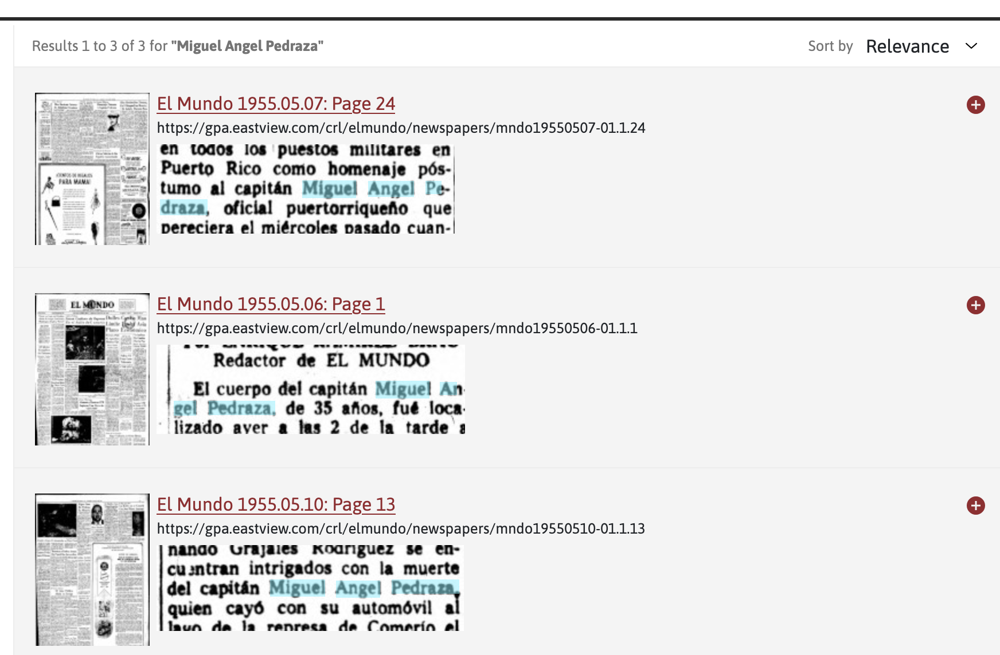

該当記事を全てスクショで切り抜いてOCRさせ、ChatGPTに読ませる。

> 記事中に、
>
> > **automóvil Chrysler 39-735, propiedad del capitán**
> > （大尉所有のクライスラー車 39-735）
>
> とあるため、車のナンバーは **39-735** です。
> 
> したがってFlagは、
> 
> ```text
> Diver26{39735}
> ```


### 39 (296pt / 162 solves)

### kohaku (100pt / 456 solves)

## introduction

### arcade (100pt / 244 solves)

Running the image through an AI immediately gave the asnwer.

### excited (100pt / 321 solves)
日本代表のユニフォーム、ダラスでのWカップの試合であることから、[JFAのサイト](https://www.jfa.jp/samuraiblue/worldcup_2026/schedule_result/)を見ることでダラススタジアム(AT&Tスタジアム)であることが予想される。また、実際に特徴的なスタジアムの柱が後ろに写る景色と一致することがわかる。

また、この映像は通常の16:9などの動画をショート動画用に切り抜いたものであることが字幕等から読み取れる。そこで次に、この動画のフルバージョンを探す。FOX 4 Newsで該当する動画がないか、`Wcup japanese fox4`などと検索すると[この動画](https://www.youtube.com/watch?v=0-mprLWyanQ)にたどり着く。

後ろの柱が特徴的なので、Google Mapの3Dビューで見ると右側の方に見つかる(赤枠で囲んだ部分)ため、ここが正解である。後ろに柱が1本しかないことと道路の状況から、詳細な位置を掴むことができる。

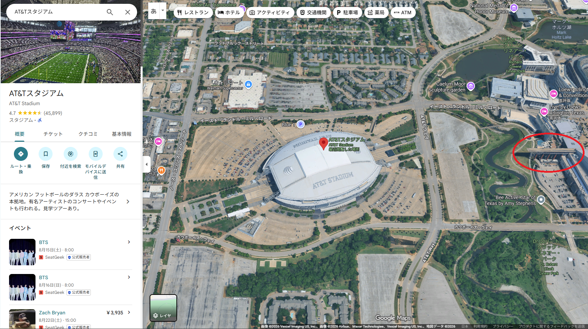

32.748167, -97.086046


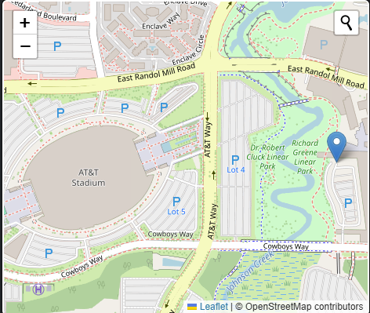


### where (100pt / 330 solves)
車のナンバーから韓国であることは自明。韓国には、電柱に番号札があるらしい。電柱を見ると確かに番号札が存在し、電柱の場所を示す番号は`0224F981`である。

次にこの番号から場所を探す。探せるサイトを探したら[このサイト](https://cartographer.ivyro.net/upload_act3.php)が出てきたので、左上に先ほどの番号を入れると4か所出てきたので全部確認する。

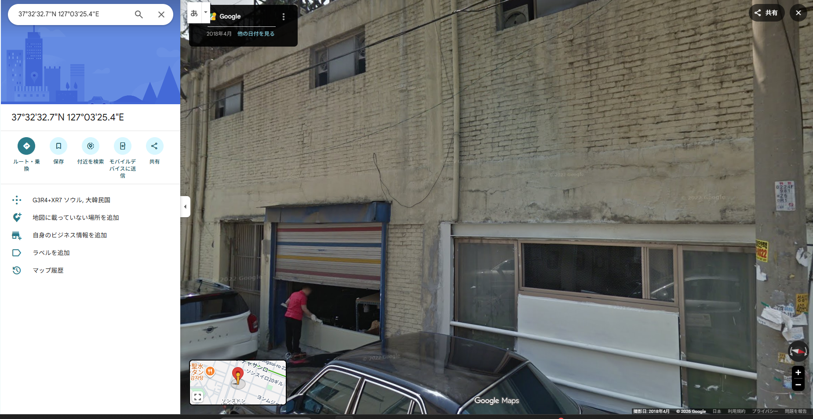

この場所は、看板こそ違うもののガレージや窓が写真と同じである。また、電柱の番号も一致している。

37.32327, 127.03254


### 8pm (100pt / 387 solves)

After searching hard enough, I was lucky enough to come across this youtube video. https://www.youtube.com/watch?v=UHQu2WkyrHk

Screenshotting from the video and running them through an AI gets you the name of the facility, Pyongyang Secondary School. Quick search in Openstreetmap gives the ID.

### container (100pt / 463 solves)

### lion (100pt / 482 solves)

Putting the image through image search tells us that the image was taken on a Johannesburg Street. https://www.dongascience.com/en/news/11693

Apparently it was for filming. https://nypost.com/2016/04/15/a-lion-named-columbus-decided-to-explore-johannesburg/

It's called Braamlion. https://iol.co.za/news/south-africa/gauteng/2016-04-12-the-mystery-of-the-braamlion/

And it is in Braamfontein, Johannesburg. https://iol.co.za/news/south-africa/gauteng/2016-04-14-mystery-of-braamlion-solved/

After cross-referencing few other images, the sign on the shop in the background looked suspiciously familiar, like Nando's. Taking a shot in the dark and searching "Braamfontein Johannesburg Nandos" leads to the answer in street view.


### read_qr (100pt / 547 solves)

`read_qr.jpg`をQRコードリーダで読めばOK  
個人的には[クルクル](https://www.qrqrq.com/)がおすすめ

`Diver26{https://qr.intro26.workers.dev/q/y0u_r34d_7h3_qr_wi7h0u7_4cc3ss}`

### momo (100pt / 558 solves)
`peach 太平電業`などと調べると、[このサイト](https://pps.main.jp/peachfleets.html)にたどり着く。太平電業ロゴ機だったことがあるのは`JA823P`と`JA828P`である。

次に、この2つのうちどちらであるかを判断する。実際の機体の写真を[`JA823P`](https://flyteam.jp/registration/JA823P)と[`JA828P`](https://flyteam.jp/photo/4465779)のそれぞれにおいて確認すると、`JA823P`はロゴの部分のキャッチコピーが「豊かな社会とこれからも。」であり、`JA828P`は「インフラ支え75年」となっている。

今回の問題は「豊かな社会とこれからも。」であるため、`JA823P`である。

`Diver26{JA823P}`

### owner (100pt / 590 solves)


目を凝らせば見える。

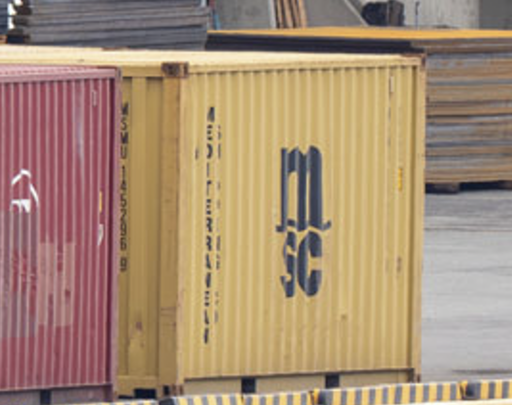


MSCのサイトからトラッキングする。
https://www.msc.com/en/track-a-shipment 

`MSMU 1452969`で検索する。


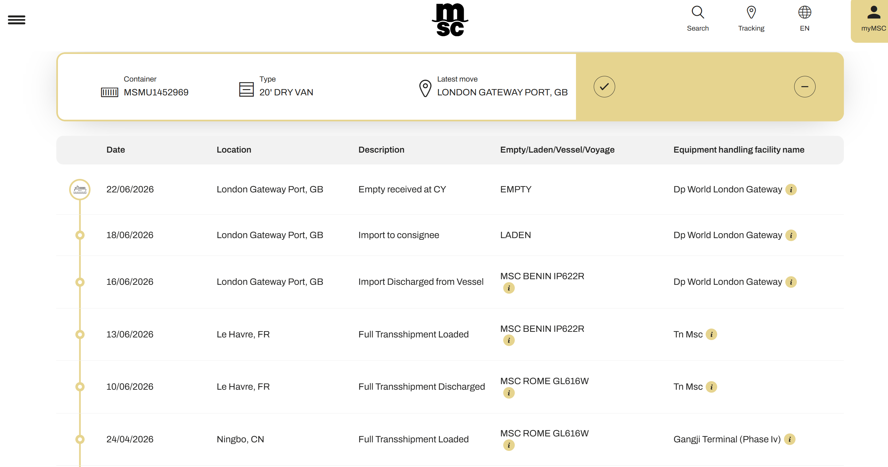


Marine Trafficより、`MSC BENIN IP622R`のIMO番号は`9974565`。

`Diver26{9974565}`


## military

### 0802 (493pt / 32 solves)

### diode (460pt / 73 solves)

War SanctionのデータベースからSchottky diodeを見つけた。

https://war-sanctions.gur.gov.ua/en/page-geran-4?f%5Bcountry_id%5D=&f%5Bmanufacturer_id%5D=&i%5Bmarking%5D=&f%5Bsearch%5D=schottky%20diode 


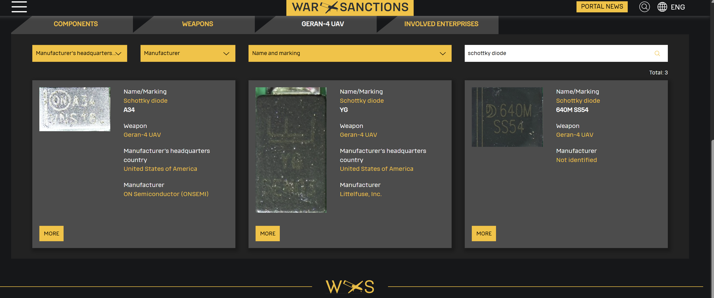


左からオンセミ、Littlefuse、山東晶導微電子である。答えは山東のものだが、確認不足でオンセミを回答してしまった。ちなみに、オンセミはFCUには使われておらず、、WAR SANCTIONSのページを確認すればどのコンポーネントに使われているかは書いてあった。


## misc

### sunny_saturday (436pt / 91 solves)

時刻は動画内から確認でき、16:15頃と推定。

「100.80.60.展」の開催期間と土曜日という情報から、
- 4/25
- 5/2
- 5/9
- 5/16
- 5/23
- 5/30

のどれかであると推測。

候補が多いので、天気から絞れないかChatGPTに調べさせる。

> * 映像は直射日光が強い一方、青空にかなり雲があります。
> * 通行人はジャケット、スーツ、長袖が中心で、16時台としては比較的涼しそうです。
> * 気象庁の東京の記録と比較すると次のようになります。
> 
> | 候補日      | 16時ごろの状況       | 映像との整合性    |
> | -------- | -------------- | ---------- |
> | **4/25** | 約17.2℃、晴れ、雲量多め | **非常に高い**  |
> | 5/2      | 約25.5℃、晴れ      | 服装がやや厚すぎる  |
> | **5/9**  | 約22.5℃、晴れ、雲量多め | **次点**     |
> | 5/16     | 約25.0℃、ほぼ快晴    | 映像より空が晴れすぎ |
> | 5/23     | 日照ほぼなし、曇り      | 除外可能       |
> | 5/30     | 約27.3℃、快晴      | 暑すぎ、晴れすぎ   |

気温と服装から推測する考えは頭になかった。

初回なので、確度低いが4/25で提出したら correct

`Diver26{2026-04-25_16:15}`


### paint (400pt / 114 solves)

### buyout (320pt / 152 solves)

### nui (100pt / 242 solves)

## recon

### shopping1 (100pt / 313 solves)

注文ボタンを押すと、外部にカード情報をPOSTする不審な通信があることがわかる。
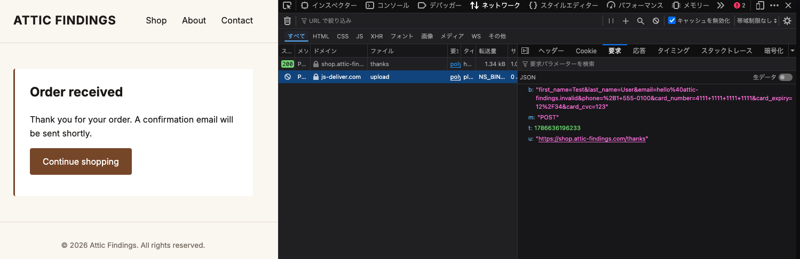

https[://]js-deliver.com/upload

怪しいので見に行ってみる。
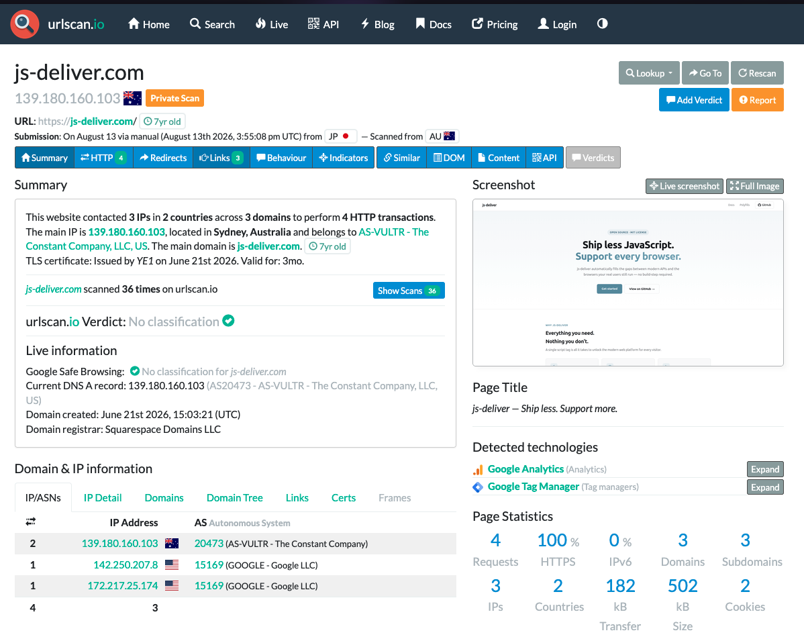


GitHubをやっているようだ


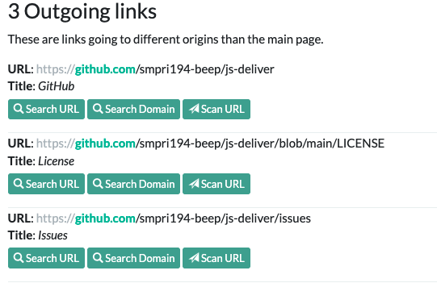

`Diver26{smpri194-beep}`


### shopping2 (275pt / 170 solves)
**FB🩸取りました！**

ProfileにこんなGistがあった。

https://gist.github.com/smpri194-beep/d3caac338832b3933e04e7dee256e7b9

`plain-cherry-ca06`というWorkersがある。


Cloudflare Workersのドメインは

`{App名}.{ユーザー固有のハンドル}.workers.dev`

である。

GitHubのハンドルから推測する。


- plain-cherry-ca06.smpri194-beep.workers.dev
  - ❌️ 存在しない
- plain-cherry-ca06.smpri194.workers.dev
  - ⭕️ 存在！

念のため中身を見るが、似たようなevilなJSを配布していそうなサイトだ。

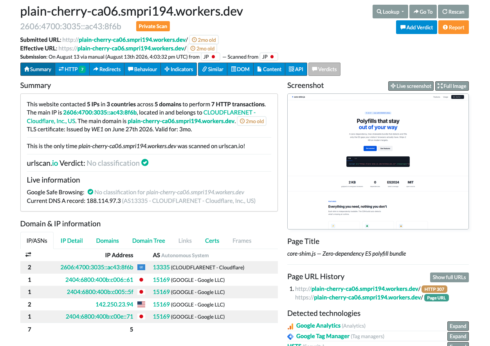

よって `Diver26{plain-cherry-ca06.smpri194.workers.dev}`

## report

### suspicious_acft (500pt / 0 solves)

レジ番をGoogleで検索して事実確認をしつつ，ChatGPTに投げて更なる調査&レポート作成をしてもらった．  
かなり長いレポートが吐き出されたので，内容を確認しつつ大幅に削った．

以下の内容で提出．400pt獲得．

```markdown
# 旧JA709J（N837KW）のイラン向け移送疑惑に関する調査

**調査基準日：2026年7月25日**
**対象機：Boeing 777-246ER、MSN 32896、旧登録JA709J／N837KW**

## 結論

2026年7月25日時点で、対象機がイランへ移送された、またはイラン向けに売却されたことを示す公開情報は確認できない。

対象機が米国から上海へ移動し、その翌日に米国登録を抹消されたことは事実である。しかし、上海到着後の新登録、対象機の出発は確認されていない。

したがって、SNS上の「イランへ移送される可能性が高い」という主張は、過去の制裁回避事例との類推に基づく仮説であり、**現時点では根拠不十分**と判定する。

---

## 1. 2026年春から7月25日までの動向

### 1.1 対象機の商談履歴

対象機は日本航空がJA709Jとして運航していたBoeing 777-246ER、MSN 32896で、退役後は米国登録N837KWとなった。

同機については、イラン疑惑が発生する以前から複数の通常商談が存在した。2023年には、ケニアのSafe AirがN837KWと姉妹機N836KWを36か月のオペレーティング・リースで導入するLOIを締結し、N837KWは同年11月に納入予定と報じられた。[^1]しかし、この計画が実現した形跡はない。

その後はナイジェリアのAir Peace向けとする情報が確認されていたが、2026年7月25日までに同社への引渡しや就航は確認できなかった。Air Peaceが契約をキャンセルしたとの一次資料も確認できない。[^8]

一方、姉妹機N836KW、旧JA710Jは実際にAir Peaceの5N-CEGとなっている。このため、旧JALのB777をアフリカの航空会社へ再販する計画自体は、制裁回避とは無関係な通常の商取引として成立していたと考えられる。

### 1.2 上海への移動

2026年5月18日、N837KWは米国カンザスシティを出発し、上海浦東国際空港へ移動した。5月19日には、JAL塗装とN837KWの登録記号を残した状態で上海浦東に駐機している写真が複数撮影された。[^2][^3]

### 1.3 米国登録の抹消

FAAの公開情報では、N837KWは2026年5月20日付で `CANCELLED/NOT ASSIGNED` となっている。[^4]

登録抹消は、外国への売却や登録変更の際にも通常行われるため、それ自体はイラン向け取引の証拠にならない。

### 1.4 上海到着後

2026年7月25日までの公開情報からは、以下を確認できなかった。

* 5月19日より後に撮影された対象機の写真
* 上海からの出発航跡
* 新しい登録記号
* 新しい24-bit ICAOアドレス
* アフリカや中東への移動

したがって、公開情報によって直接確認できる最後の所在地は、2026年5月19日の上海浦東国際空港である。

香港での所有者とされるHong Kong Fly Tourism Co., Limited、中文名「港飛旅遊有限公司」は、香港会社登記処の資料上、2017年3月13日に会社番号2498038として設立された実在法人である。[^5]

一方、同社とN837KWとの法的関係を示す売買契約、航空機登録、リース契約、耐空証明または運航証明は公開情報では確認できなかった。

## 2. 噂の真偽の検討

### 2.1 過去のイラン移送事例との比較

2025年には、元Singapore Airlines／NokScootのB777-200ER 5機が、米国登録からマダガスカルの暫定登録へ変更された後、カンボジアを出発し、アフガニスタン上空付近でトランスポンダを停止してイランへ移送された。

米商務省BISは、この5機について米国登録、マダガスカル登録およびMSNを特定している。米財務省OFACも、後にMahan AirのEP-MTBをMSN 28527、EP-MTEをMSN 33369として制裁対象に追加した。[^6][^7]

この事例では、MSNは変更されず、以下が変更または偽装された。

* 登録国と登録記号
* 24-bit ICAOアドレス
* 所有者・運航者名義
* 飛行計画上の目的地
* トランスポンダの送信状態

ADS-BはMSNを直接送信せず、24-bit aircraft address、Flight ID、位置、高度などを送信する。追跡サイト上のMSNは、24-bit addressと外部データベースを対応させた結果である。したがって、登録変更後は同じ物理的機体でも別のhexとして表示される可能性がある。

ただし、過去の確認済み事例では、次の兆候が複合的に現れていた。

* 実体の不透明な第三国企業への移転
* 出発直前の第三国登録
* 表向きの目的地と実際の航路の不一致
* イラン接近時のADS-B消失
* イラン側での再出現
* `EP-`登録または制裁当局によるMSNの特定

N837KWについて確認できるのは、上海への移動、米国登録の抹消、民間DB上での香港企業との関連付けまでである。第三国登録、上海からの出発、ADS-Bの不自然な消失、イランでの再出現は確認できない。

### 2.2 判定

> **「N837KWが既にイランへ移送された」という噂は、2026年7月25日時点では裏付けられない。**
>
> **「将来イランへ移送される可能性が高い」という主張も、過去事例との表面的な類似に基づく推測であり、確度は低い。**

対象機にはSafe Air、Air Peace向けという通常の商談履歴があり、姉妹機も実際にAir Peaceへ導入されている。このため、現時点では次の説明が最も合理的である。

> **複数の導入商談が不成立または変更された中古機が、上海で次の売却、整備、改修または保管の対象となっている。**

ただし、上海到着後の所有者と用途が判明していないため、将来的なイラン向け転売の可能性を完全に排除することはできない。

**総合判定：噂は根拠不十分**
**判定確度：中～高**

## 3. 確度を高めるために必要な情報

公開情報だけでは、上海到着後の所有者、登録、移動を確定できなかった。確度を高めるには、以下の情報が必要である。

### 3.1 新しい登録記号と24-bit address

以下の国・地域の登録簿などを、登録記号ではなく`MSN 32896`で検索する。

* 中国・香港
* ナイジェリア・ケニア
* マダガスカル・ガンビア・ブルキナファソ
* カンボジア・インドネシア
* UAE・オマーン
* イラン

データソースとして、各国航空当局の公開登録簿、Planespotters、Airfleets、JetPhotos、Scramble、航空機生産リストなどがある。

### 3.2 FAA登録記録

最も決定力が高いのはFAAの完全なAircraft Recordである。

N番号 `N837KW` とMSN `32896` を指定して記録を取得できれば、少なくとも米国登録抹消時に申告された輸出先国を確認できる可能性がある。

ただし、申告上の輸出先が中国であっても、その後の再輸出先がイランでないことまでは証明できない。

## 参考文献

[^1]: [“Kenya’s Safe Air Expands Fleet with B777s and Wet-Leased A330”](https://airspace-africa.com/2023/07/04/kenyas-safe-air-expands-fleet-with-b777s-and-wet-leased-a330/)

[^2]: [「元JAL 777が鶴丸で上海へ？　特集・JAL 777-200ER退役後のいま」](https://www.aviationwire.jp/archives/343987)

[^3]: [“N837KW aviation photos”](https://www.jetphotos.com/registration/N837KW)

[^4]: [“N-Number Inquiry Results: N837KW”](https://registry.faa.gov/aircraftinquiry/Search/NNumberResult?NNumberTxt=837KW)

[^5]: [List of Newly Incorporated Companies, 13–19 March 2017](https://www.cr.gov.hk/docs/wrpt/RNC063_2017.03.13-2017.03.19.pdf)

[^6]: [“Order Renewing Order Temporarily Denying Export Privileges”](https://www.federalregister.gov/documents/2025/10/31/2025-19727/order-renewing-order-temporarily-denying-export-privileges)

[^7]: [“Counter Terrorism Designations; Non-Proliferation Designations”](https://ofac.treasury.gov/recent-actions/20260421)

[^8]: https://travelnews.africa/news-single.html?id=16107
```

## sns

### link (493pt / 32 solves)
詳細は省略。中華系のSNSを追うことで見つけることが可能だった。

中国本土では`Weibo`, `Xiao Hong Shu`、`Dou Yin`あたりのSNSが主流である。


## transportation

### 250 (461pt / 72 solves)

画像から車体番号は20094と特定。

ChatGPTに調べさせると、以下のサイトに時刻と位置があるらしい。

https://gtfsrt.io/

BCTのVehicle PositionsをDuckDBで取得する。

```sql
WITH params AS (
    SELECT make_timestamptz(
        2026, 7, 4,
        18, 0, 0,
        'America/New_York'
    ) AS center_time
),
positions AS (
    SELECT
        to_timestamp("timestamp") AS observed_at,
        vehicle_id,
        vehicle_label,
        route_id,
        trip_id,
        direction_id,
        stop_id,
        current_status,
        latitude,
        longitude,
        bearing,
        speed
    FROM read_parquet(
        'http://parquet.gtfsrt.io/vehicle_positions/date=2026-07-04/base64url=aHR0cHM6Ly9iY3RteXJpZGUtYnVzcGFzLmNvbTo4MDgwL0dURlMvVmVoaWNsZVBvc2l0aW9ucw/data.parquet'
    )
    WHERE vehicle_id = '20094'
       OR vehicle_label = '20094'
)
SELECT
    observed_at AS observed_local,
    route_id,
    trip_id,
    direction_id,
    stop_id,
    latitude,
    longitude,
    speed,
    abs(date_diff('second', center_time, observed_at))
        AS seconds_from_1800
FROM positions
CROSS JOIN params
ORDER BY seconds_from_1800
LIMIT 10;
```

**結果(表示の都合で精度低め)**
|observed_local|route_id|trip_id|direction_id|stop_id|latitude|longitude|speed|seconds_from_1800|
|--|--|--|--|--|--|--|--|--|
|2026-07-04 21:59:53+00|BCT36|26MAY_36-01_8_s|||26.145458|-80.211624||7|
|2026-07-04 22:00:11+00|BCT36|26MAY_36-01_8_s|||26.145428|-80.21012||11|
|2026-07-04 21:59:34+00|BCT36|26MAY_36-01_8_s|||26.14545|-80.21191||26|
|2026-07-04 22:00:33+00|BCT36|26MAY_36-01_8_s|||26.145693|-80.20806||33|
|2026-07-04 21:59:20+00|BCT36|26MAY_36-01_8_s|||26.144924|-80.21198||40|
|2026-07-04 22:01:06+00|BCT36|26MAY_36-01_8_s|||26.146013|-80.20529||66|
|2026-07-04 21:58:51+00|BCT36|26MAY_36-01_8_s|||26.143188|-80.21231||69|
|2026-07-04 22:01:16+00|BCT36|26MAY_36-01_8_s|||26.146023|-80.20459||76|
|2026-07-04 21:58:35+00|BCT36|26MAY_36-01_8_s|||26.141933|-80.212616||85|
|2026-07-04 22:01:36+00|BCT36|26MAY_36-01_8_s|||26.146048|-80.204094||96|

一番上を選択
`lat:26.145458221435547,lon:-80.21162414550781`
### air2air2 (445pt / 85 solves)

下の風景（特に鉄塔）が日本っぽい．  


エア・カナダのBoeing 777-300ER  


FlyTeamで探してみた．エア・カナダにB777-300は19機しかいないらしい  
https://flyteam.jp/airline/air-canada/aircrafts?filtertype=model&filtercode=777-300

2026年1月9日時点でこの塗装をしていて，同じような光の当たり方をしている機体としてC-FIVWを発見  
https://flyteam.jp/photo/4345788

成田空港らしいので，Flightrader24で探してACA9であると判断  


`Diver26{C-FIVW_ACA9}`

撮影者側の機体もヒントにしようとしたが，うまく特定できず...  
Air Japanの塗装だったのか....（知らなかった）

### telelens (337pt / 145 solves)

画面右上にJGASの建物が見える．
羽田空港の西端を撮影したものと判断．  


JA742Jが駐機してあるのは981番スポットだと分かる．  


塗装が特徴的な機体が見える．記念塗装？  
Air Niugini→ニューギニア航空．  


2026年2月9日に飛来，985番スポットに駐機されていて，2月11日に帰ったらしい．  
https://flyteam.jp/news/article/144847

2月9日～11日の間で，雨が降っていた日は2月11日．  
https://tenki.jp/past/2026/02/11/weather/3/16/47662/

`Diver26{2026-02-11}`

### conflicted (311pt / 156 solves)

### dx (162pt / 208 solves)

## welcome
**省略**

> ### 00_welcome (10pt / 865 solves)
> ### 01_automation (10pt / 861 solves)
> ### 02_interact (10pt / 860 solves)
> ### 03_leak (10pt / 860 solves)
> ### 04_attempt_limit (10pt / 860 solves)
> ### 05_writeup_rules (10pt / 859 solves)
> ### 06_tell_your_teammate (10pt / 859 solves)