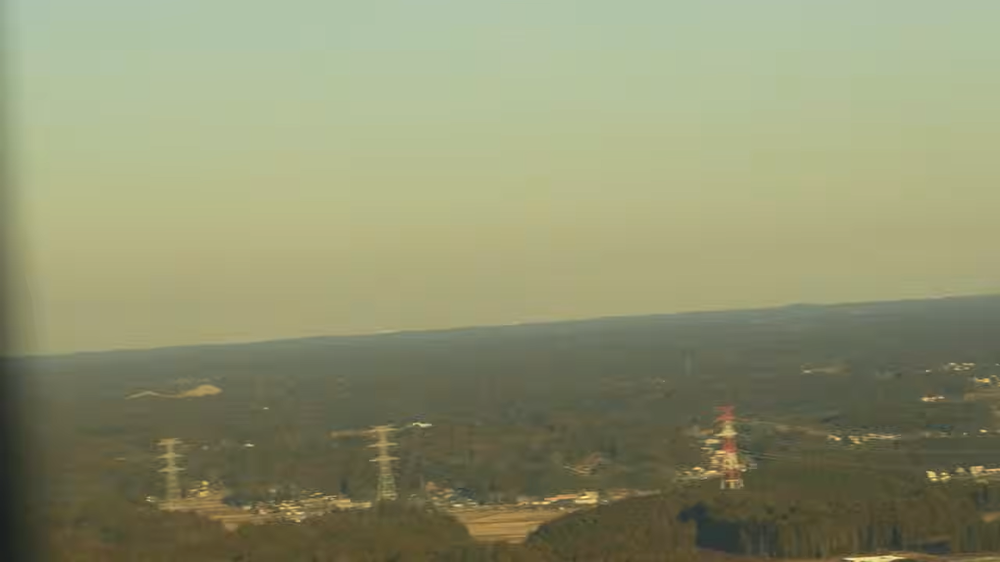
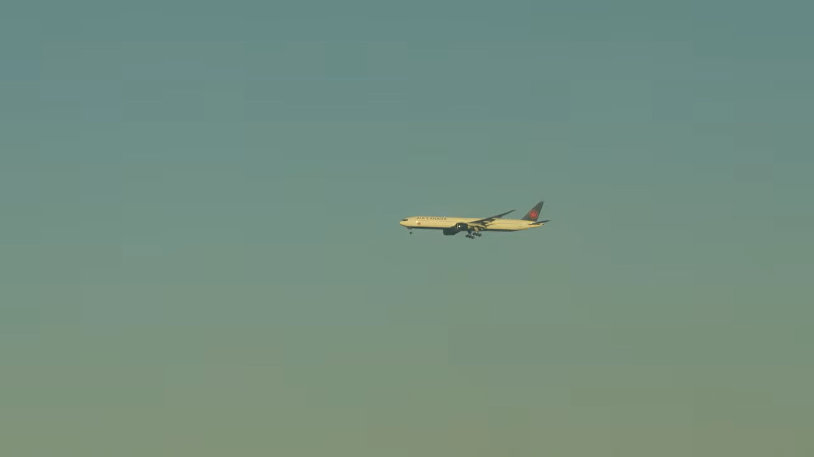
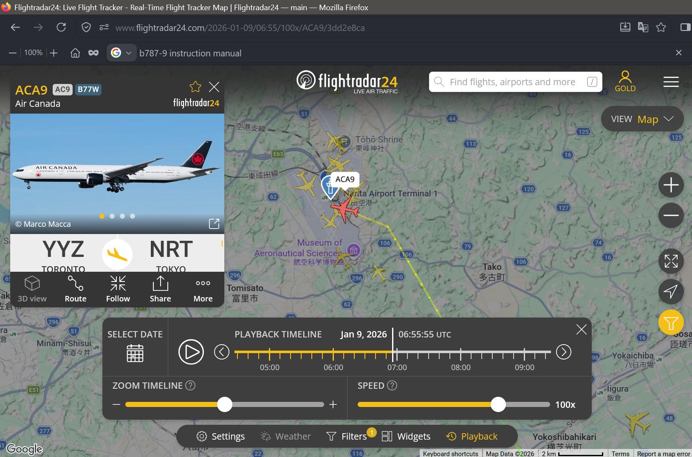
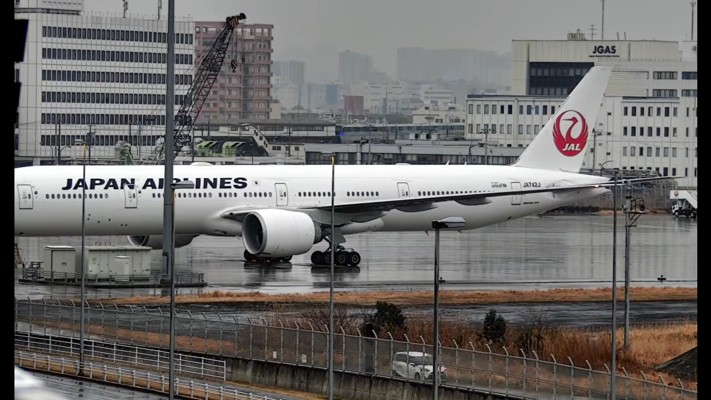
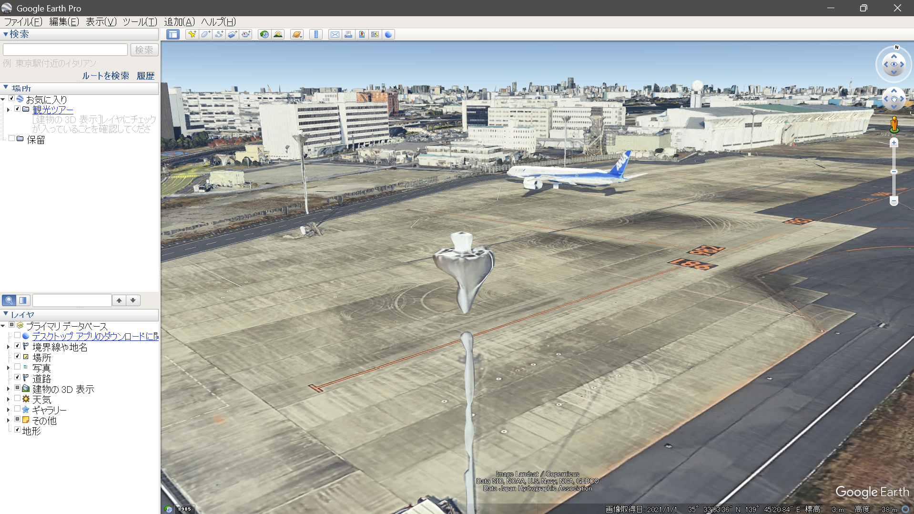
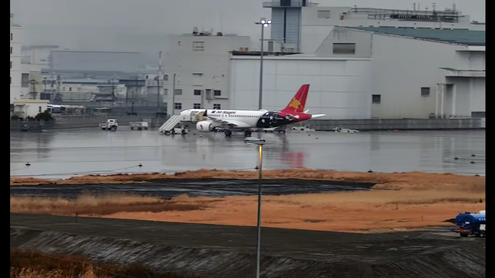

# DIVER OSINT CTF 2026 Writeup
hello,
test

うわあああああああああああ

ガチでこんにちは

```bash
alias vim=emacs
cd a
cd b
kill emacs
find / | grep vim
```

<h1>aaaaa</h1>

$$1=1$$

https://localhost:8080/naotiki 

## company

### arctic (277pt / 169 solves)

### cooking (100pt / 384 solves)

## crypto

### druk (407pt / 110 solves)

### stable (339pt / 144 solves)

## disinfo

### rch (500pt / 124 solves)

## geo

### trot (491pt / 35 solves)

### houses (484pt / 46 solves)

### elevation (481pt / 51 solves)

### stargazing (417pt / 104 solves)

### kaitai1 (450pt / 81 solves)

### kaitai2 (390pt / 119 solves)

### kaitai3 (498pt / 19 solves)

### evacuation (318pt / 153 solves)

### sprej (178pt / 203 solves)

### F3 (100pt / 244 solves)

## hardware

### yonezu1 (100pt / 316 solves)

### yonezu2 (100pt / 245 solves)

## history

### tuition (483pt / 48 solves)

### accident (398pt / 115 solves)

### 39 (296pt / 162 solves)

### kohaku (100pt / 456 solves)

## introduction

### arcade (100pt / 244 solves)

### excited (100pt / 321 solves)

### where (100pt / 330 solves)

### 8pm (100pt / 387 solves)

### container (100pt / 463 solves)

### lion (100pt / 482 solves)

### read_qr (100pt / 547 solves)

`read_qr.jpg`をQRコードリーダで読めばOK  
個人的には[クルクル](https://www.qrqrq.com/)がおすすめ

`Diver26{https://qr.intro26.workers.dev/q/y0u_r34d_7h3_qr_wi7h0u7_4cc3ss}`

### momo (100pt / 558 solves)

### owner (100pt / 590 solves)

## military

### 0802 (493pt / 32 solves)

### diode (460pt / 73 solves)

## misc

### sunny_saturday (436pt / 91 solves)

### paint (400pt / 114 solves)

### buyout (320pt / 152 solves)

### nui (100pt / 242 solves)

## recon

### shopping1 (100pt / 313 solves)

### shopping2 (275pt / 170 solves)

## report

### suspicious_acft (500pt / 0 solves)

レジ番をGoogleで検索して事実確認をしつつ，ChatGPTに投げて更なる調査&レポート作成をしてもらった．  
かなり長いレポートが吐き出されたので，内容を確認しつつ大幅に削った．

以下の内容で提出．400pt獲得．

```
# 旧JA709J（N837KW）のイラン向け移送疑惑に関する調査

**調査基準日：2026年7月25日**
**対象機：Boeing 777-246ER、MSN 32896、旧登録JA709J／N837KW**

## 結論

2026年7月25日時点で、対象機がイランへ移送された、またはイラン向けに売却されたことを示す公開情報は確認できない。

対象機が米国から上海へ移動し、その翌日に米国登録を抹消されたことは事実である。しかし、上海到着後の新登録、対象機の出発は確認されていない。

したがって、SNS上の「イランへ移送される可能性が高い」という主張は、過去の制裁回避事例との類推に基づく仮説であり、**現時点では根拠不十分**と判定する。

---

## 1. 2026年春から7月25日までの動向

### 1.1 対象機の商談履歴

対象機は日本航空がJA709Jとして運航していたBoeing 777-246ER、MSN 32896で、退役後は米国登録N837KWとなった。

同機については、イラン疑惑が発生する以前から複数の通常商談が存在した。2023年には、ケニアのSafe AirがN837KWと姉妹機N836KWを36か月のオペレーティング・リースで導入するLOIを締結し、N837KWは同年11月に納入予定と報じられた。[^1]しかし、この計画が実現した形跡はない。

その後はナイジェリアのAir Peace向けとする情報が確認されていたが、2026年7月25日までに同社への引渡しや就航は確認できなかった。Air Peaceが契約をキャンセルしたとの一次資料も確認できない。[^8]

一方、姉妹機N836KW、旧JA710Jは実際にAir Peaceの5N-CEGとなっている。このため、旧JALのB777をアフリカの航空会社へ再販する計画自体は、制裁回避とは無関係な通常の商取引として成立していたと考えられる。

### 1.2 上海への移動

2026年5月18日、N837KWは米国カンザスシティを出発し、上海浦東国際空港へ移動した。5月19日には、JAL塗装とN837KWの登録記号を残した状態で上海浦東に駐機している写真が複数撮影された。[^2][^3]

### 1.3 米国登録の抹消

FAAの公開情報では、N837KWは2026年5月20日付で `CANCELLED/NOT ASSIGNED` となっている。[^4]

登録抹消は、外国への売却や登録変更の際にも通常行われるため、それ自体はイラン向け取引の証拠にならない。

### 1.4 上海到着後

2026年7月25日までの公開情報からは、以下を確認できなかった。

* 5月19日より後に撮影された対象機の写真
* 上海からの出発航跡
* 新しい登録記号
* 新しい24-bit ICAOアドレス
* アフリカや中東への移動

したがって、公開情報によって直接確認できる最後の所在地は、2026年5月19日の上海浦東国際空港である。

香港での所有者とされるHong Kong Fly Tourism Co., Limited、中文名「港飛旅遊有限公司」は、香港会社登記処の資料上、2017年3月13日に会社番号2498038として設立された実在法人である。[^5]

一方、同社とN837KWとの法的関係を示す売買契約、航空機登録、リース契約、耐空証明または運航証明は公開情報では確認できなかった。

## 2. 噂の真偽の検討

### 2.1 過去のイラン移送事例との比較

2025年には、元Singapore Airlines／NokScootのB777-200ER 5機が、米国登録からマダガスカルの暫定登録へ変更された後、カンボジアを出発し、アフガニスタン上空付近でトランスポンダを停止してイランへ移送された。

米商務省BISは、この5機について米国登録、マダガスカル登録およびMSNを特定している。米財務省OFACも、後にMahan AirのEP-MTBをMSN 28527、EP-MTEをMSN 33369として制裁対象に追加した。[^6][^7]

この事例では、MSNは変更されず、以下が変更または偽装された。

* 登録国と登録記号
* 24-bit ICAOアドレス
* 所有者・運航者名義
* 飛行計画上の目的地
* トランスポンダの送信状態

ADS-BはMSNを直接送信せず、24-bit aircraft address、Flight ID、位置、高度などを送信する。追跡サイト上のMSNは、24-bit addressと外部データベースを対応させた結果である。したがって、登録変更後は同じ物理的機体でも別のhexとして表示される可能性がある。

ただし、過去の確認済み事例では、次の兆候が複合的に現れていた。

* 実体の不透明な第三国企業への移転
* 出発直前の第三国登録
* 表向きの目的地と実際の航路の不一致
* イラン接近時のADS-B消失
* イラン側での再出現
* `EP-`登録または制裁当局によるMSNの特定

N837KWについて確認できるのは、上海への移動、米国登録の抹消、民間DB上での香港企業との関連付けまでである。第三国登録、上海からの出発、ADS-Bの不自然な消失、イランでの再出現は確認できない。

### 2.2 判定

> **「N837KWが既にイランへ移送された」という噂は、2026年7月25日時点では裏付けられない。**
>
> **「将来イランへ移送される可能性が高い」という主張も、過去事例との表面的な類似に基づく推測であり、確度は低い。**

対象機にはSafe Air、Air Peace向けという通常の商談履歴があり、姉妹機も実際にAir Peaceへ導入されている。このため、現時点では次の説明が最も合理的である。

> **複数の導入商談が不成立または変更された中古機が、上海で次の売却、整備、改修または保管の対象となっている。**

ただし、上海到着後の所有者と用途が判明していないため、将来的なイラン向け転売の可能性を完全に排除することはできない。

**総合判定：噂は根拠不十分**
**判定確度：中～高**

## 3. 確度を高めるために必要な情報

公開情報だけでは、上海到着後の所有者、登録、移動を確定できなかった。確度を高めるには、以下の情報が必要である。

### 3.1 新しい登録記号と24-bit address

以下の国・地域の登録簿などを、登録記号ではなく`MSN 32896`で検索する。

* 中国・香港
* ナイジェリア・ケニア
* マダガスカル・ガンビア・ブルキナファソ
* カンボジア・インドネシア
* UAE・オマーン
* イラン

データソースとして、各国航空当局の公開登録簿、Planespotters、Airfleets、JetPhotos、Scramble、航空機生産リストなどがある。

### 3.2 FAA登録記録

最も決定力が高いのはFAAの完全なAircraft Recordである。

N番号 `N837KW` とMSN `32896` を指定して記録を取得できれば、少なくとも米国登録抹消時に申告された輸出先国を確認できる可能性がある。

ただし、申告上の輸出先が中国であっても、その後の再輸出先がイランでないことまでは証明できない。

## 参考文献

[^1]: [“Kenya’s Safe Air Expands Fleet with B777s and Wet-Leased A330”](https://airspace-africa.com/2023/07/04/kenyas-safe-air-expands-fleet-with-b777s-and-wet-leased-a330/)

[^2]: [「元JAL 777が鶴丸で上海へ？　特集・JAL 777-200ER退役後のいま」](https://www.aviationwire.jp/archives/343987)

[^3]: [“N837KW aviation photos”](https://www.jetphotos.com/registration/N837KW)

[^4]: [“N-Number Inquiry Results: N837KW”](https://registry.faa.gov/aircraftinquiry/Search/NNumberResult?NNumberTxt=837KW)

[^5]: [List of Newly Incorporated Companies, 13–19 March 2017](https://www.cr.gov.hk/docs/wrpt/RNC063_2017.03.13-2017.03.19.pdf)

[^6]: [“Order Renewing Order Temporarily Denying Export Privileges”](https://www.federalregister.gov/documents/2025/10/31/2025-19727/order-renewing-order-temporarily-denying-export-privileges)

[^7]: [“Counter Terrorism Designations; Non-Proliferation Designations”](https://ofac.treasury.gov/recent-actions/20260421)

[^8]: https://travelnews.africa/news-single.html?id=16107
```

## sns

### link (493pt / 32 solves)

## transportation

### 250 (461pt / 72 solves)

### air2air2 (445pt / 85 solves)

下の風景（特に鉄塔）が日本っぽい．  


エア・カナダのBoeing 777-300ER  


FlyTeamで探してみた．エア・カナダにB777-300は19機しかいないらしい  
https://flyteam.jp/airline/air-canada/aircrafts?filtertype=model&filtercode=777-300

2026年1月9日時点でこの塗装をしていて，同じような光の当たり方をしている機体としてC-FIVWを発見  
https://flyteam.jp/photo/4345788

成田空港らしいので，Flightrader24で探してACA9であると判断  


`Diver26{C-FIVW_ACA9}`

撮影者側の機体もヒントにしようとしたが，うまく特定できず...  
Air Japanの塗装だったのか....（知らなかった）

### telelens (337pt / 145 solves)

画面右上にJGASの建物が見える．
羽田空港の西端を撮影したものと判断．  


JA742Jが駐機してあるのは981番スポットだと分かる．  


塗装が特徴的な機体が見える．記念塗装？  
Air Niugini→ニューギニア航空．  


2026年2月9日に飛来，985番スポットに駐機されていて，2月11日に帰ったらしい．  
https://flyteam.jp/news/article/144847

2月9日～11日の間で，雨が降っていた日は2月11日．  
https://tenki.jp/past/2026/02/11/weather/3/16/47662/

`Diver26{2026-02-11}`

### conflicted (311pt / 156 solves)

### dx (162pt / 208 solves)

## welcome

### 00_welcome (10pt / 865 solves)

### 01_automation (10pt / 861 solves)

### 02_interact (10pt / 860 solves)

### 03_leak (10pt / 860 solves)

### 04_attempt_limit (10pt / 860 solves)

### 05_writeup_rules (10pt / 859 solves)

### 06_tell_your_teammate (10pt / 859 solves)